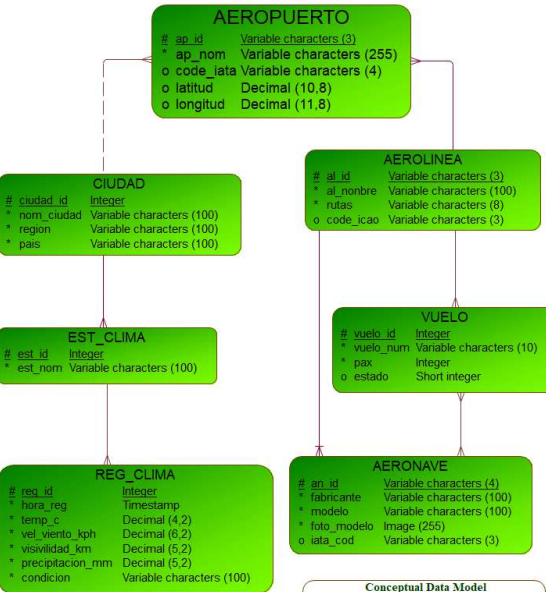
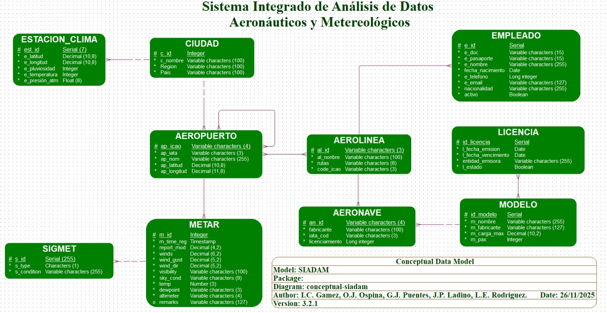

# Methodology.

The teacher keeps making at least one annoying comment about how much money he makes, kinda suggesting that this is because of his knowledge in databases, but honestly it only reads as him being insecure, and along with his "hot takes" in politics, this class is getting annoying fast. However, one thing is true and that is: he has a great methodology for desingning databases described below.

## The 11 steps for designing a database:

You have chosen the topic for your database: aeronautics and meteorology. You have some relatives in that industry, and they have mentioned in passing that there's a lot of open data that can be queried, so this sounds like a great place to start. So you write down the steps your hiddeous teacher provided for designing databases: 

  0. Divide and conquer.
  1. Estimate entities.
  2. Find relations between entities.
  3. Caracterize those relations.
  4. Define attributes.
  5. Design a conceptual model.
  6. Resolve n:m relations using auxiliary entities.
  7. Caracterize the new entities and their relations.
  8. Design the Logical model.
  9. Design the physical model.
  10. Create and run the database script. 

### The drafts

So you start working with your team on the project, you create a first draft for the conceptual model:
. 

This helps you have an idea of how the information will flow in the end and which of the entities will be able to call other entities. Once this first draft is created, you run it through your relatives to further understand the needs of the industry.

You realize this first draft is wrong for a couple of reasons: for one, there is a three entities cycle between airships, airlines and the flights. Also, the  flights themsleves are unable to differentiate between the origin and destination airports.

Now it's a good time to run the database with your relatives, you confirm with them the way the information flows. You learn that each airline shares a planning with all the airports they will be contacting on the day. Also, you realize that each airport connects with other airports, and so you arrive at the following draft:

.

### The actual models

Now that you have a better understanding of the problem and a draft to work with, you proceed with the steps. First you decide to break the problem into two parts: the aeronautics and the meteorology. 

Due to time constraints (you have less than 2 months to complete everything), you will only work on one of these two parts: mainly the aeronautics side of the project. 

